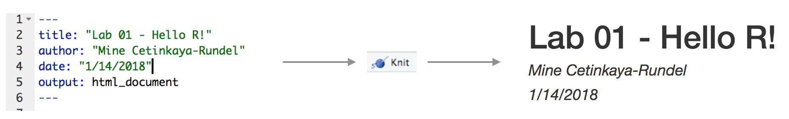

```{r include=FALSE}
knitr::opts_chunk$set(eval = FALSE)
options(
  htmltools.dir.version = FALSE, # for blogdown
  show.signif.stars = FALSE     # for regression output
)
```

**Due:** Tuesday 2020-09-22 at 5pm

# Getting started

- Go to today's module in Canvas - click "Download Lab .Rmd starter file"
- Go to RStudio Pro. Create a **New Project** by clicking File > New Project > New Directory. Name the directory something sensible (for example `02-lab-least-squares`)
- Upload the .Rmd starter file into this project and you're ready to go!


# Packages

In this lab we will work with one packages: `ISLR`.

Install this packages by running the following in the console.

```{r eval = FALSE}
install.packages("ISLR")
```

Now that the necessary packages are installed, you should be able to Knit your document and see the results.

If you'd like to run your code in the Console as well you'll also need to load the packages there. To do so, run the following in the console. 

```{r}
library(ISLR) 
```

Note that the packages are also loaded with the same commands in your R Markdown document.


```{marginfigure}
The top portion of your R Markdown file (between the three dashed lines) is called YAML. It stands for "YAML Ain't Markup Language". It is a human friendly data serialization standard for all programming languages. All you need to know is that this area is called the YAML (we will refer to it as such) and that it contains meta information about your document.
```

## YAML: 

Open the R Markdown (Rmd) file in your project, change the author name to your name, and knit the document.

```{r yaml-raw-to-rendered, fig.fullwidth=TRUE, echo = FALSE}

```

# Data

The data frame we will be working with today is called `Hitters` and it's in the `ISLR` package. 

To find out more about the dataset, type the following in your Console: `?Hitters`. A question mark before the name of an object will always bring up its help file. This command must be ran in the Console.

```{marginfigure}
Remember: The Console is at the bottom of your RStudio workspace. Things you type in the Console will not be in your final report. This is a good place to peek at data (try typing `Hitters` in the Console) and look at help files with the `?`. 
```

1. Based on the help function, how many rows (n) and how many columns (p) does the `Hitters` file have? What are the variables included in the data frame? Add your responses to your lab report. 

```{marginfigure}
Major League Baseball Data from the 1986 and 1987 seasons.
```


```{marginfigure}
Hint: A shortcut to determine how many rows are in a data frame is the `nrow` function. Run `?nrow` in the Console to learn about how this works.
```

2. Create a new data frame called `hitters_cc` with complete case data from the `Hitters` data frame. This means we are _removing all missing values_. Copy the code below to complete this task. How many rows were removed?

```{r}
hitters_cc <- Hitters[complete.cases(Hitters), ]
```


3. We are interested in predicting baseball players' salary using the number of times they were at bat and the number of hits they had. Create a design matrix, `X`, that contains two predictor variables from the `hitters_cc` data frame. Create a variable `y` that contains the outcome data for the players' salary. 

4. Using the objects created in Exercise 2 (`X` and `y`), calculate $\hat\beta$, $\hat{y}$, $\epsilon$. Interpret what these values mean.

5. Calculate the variance of $\hat\beta$ and save as `v_beta`. Hint: You can estimate $\sigma^2$ with the following formula:

$$\sigma^2 = \frac{1}{n-3}\sum_{i=1}^n\epsilon_i^2$$
Use this to calculate the standard error of your coefficients by running the following formula:

```{r, eval = FALSE}
se_beta <- sqrt(diag(v_beta))
se_beta
```

Interpret these results.

6. Using the `cor` function, compute the correlation between $y$ and $\hat{y}$ and square this output. _We will use this in a future exercise_.

7. Fit the same model as above (i.e. predict baseball players' salary using the number of times they were at bat and the number of hits they had) using the `lm` function. Save this output as an object called `lm_fit`. How does this output compare to the results in Exercises 4 and 5?

```{r, eval = FALSE}
lm_fit <- lm(---, data = hitters_cc)
lm_fit
```

8. The `residuals` function can be used to extract the residuals from a model object. Run `residuals(lm_fit)`. How does this compare to your result in Exercise 4? Hint: for a direct comparison, you can make the residuals a matrix like this: `matrix(residuals(lm_fit))`; you may also be interested in the `all.equal` function, which tests equality but allows for small differences in numeric results.

9. The `fitted` function can be used to extract $\hat{y}$ values from a model object. Run `fitted(lm_fit)`. How does this compare to your result in Exercise 4?

10. The `summary` function can be used to to calculate a summary of the model fit. Use the `summary` function on the `lm_fit` object created in Exercise 7 and save this as `lm_summary`. This will save lots of pieces of information about your model. Returning to Exercise 6, where do you see the value calculated here in the `lm_summary` output? What does this value mean?

11. The `lm_summary` object contains a `list` with lots of important summary statistics. To see all of the pieces here, run `names(lm_summary)`. To see what each of these components corresponds to, run `?summary.lm` in the Console and scroll down to the `Value` section of the help file. Describe the 11 summary statistics contained here.

12. Examine the estimate for $\sigma$ from the your linear model using `lm_summary$sigma`. How does this compare to $\sigma^2$ that you calculated in Exercise 4?

13. Examine the estimate for $(\mathbf{X}^T\mathbf{X})^{-1}$ from your linear model using `lm_summary$cov.unscaled`. How does this compare to your estimate of $(\mathbf{X}^T\mathbf{X})^{-1}$ from Exercise 4?

14. A collaborator tells you they would like to fit the model:

$$Salary = \beta_0 + \beta_1 AtBat + \beta_2 Hits + \beta_3 2\times Hits + \epsilon$$
Where the predictors are `AtBat`, `Hits`, and `2Hits` which is equal to twice the number of hits. Does this make sense? Why or why not?


