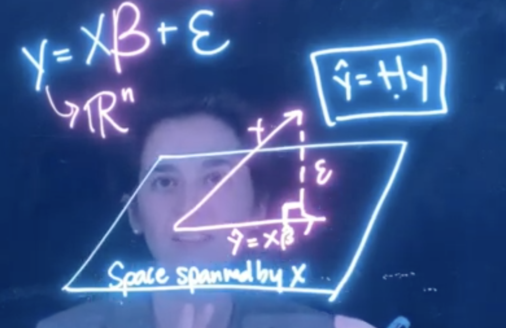

```{r, echo = FALSE}
library(countdown)
```

---

class: center, middle

## Want to avoid taking derivatives?

---

## Avoid taking a derivative with geometry!

* Recall that I mentioned the _geometric_ solution
--

* $y - \hat{y}$ is **orthogonal** to the column space of $\mathbf{X}$



---

## <i class="fas fa-pause-circle"></i> `Geometry fact`

.question[
What does it mean to be orthogonal?
]

--
Two vectors **u** and **v** are orthogonal if $\mathbf{u}\cdot\mathbf{v} = 0$ (we can also write this as $\mathbf{u}^T\mathbf{v}$)

--
* **u** = $\mathbf{X}$
* **v** = $y-\hat{y} = y-\mathbf{X}\hat\beta$

---

## <i class="fas fa-edit"></i> `Try it!`

Solve for $\hat\beta$

$$\mathbf{X}^T(y - \mathbf{X}\hat\beta) = 0$$

`r countdown(3)`

---

## Derive $\hat{\beta}$

$$
\begin{align}
\mathbf{X}^T(y - \mathbf{X}\hat\beta) &= 0\\
\end{align}
$$

---

## Derive $\hat{\beta}$

$$
\begin{align}
\mathbf{X}^T(y - \mathbf{X}\hat\beta) &= 0\\
\mathbf{X}^Ty - \mathbf{X}^T\mathbf{X}\hat\beta &= 0\\
\end{align}
$$
---

## Derive $\hat{\beta}$

$$
\begin{align}
\mathbf{X}^T(y - \mathbf{X}\hat\beta) &= 0\\
\mathbf{X}^Ty - \mathbf{X}^T\mathbf{X}\hat\beta &= 0\\
\mathbf{X}^Ty & = \mathbf{X}^T\mathbf{X}\hat\beta\\
\end{align}
$$

---

## Derive $\hat{\beta}$

$$
\begin{align}
\mathbf{X}^T(y - \mathbf{X}\hat\beta) &= 0\\
\mathbf{X}^Ty - \mathbf{X}^T\mathbf{X}\hat\beta &= 0\\
\mathbf{X}^Ty & = \mathbf{X}^T\mathbf{X}\hat\beta\\
(\mathbf{X}^T\mathbf{X})^{-1}\mathbf{X}^Ty &= \hat\beta
\end{align}
$$
---

## Getting the hat matrix

.question[
Why is it called the hat matrix? 
]

--

$$
\begin{align}
\hat{y} &= \mathbf{H}y\\
\end{align}
$$

---
## Getting the hat matrix

.question[
Why is it called the hat matrix? 
]


$$
\begin{align}
\hat{y} &= \mathbf{H}y\\
\mathbf{X}\hat\beta &= \mathbf{H}y\\
\end{align}
$$

---

## Getting the hat matrix

.question[
Why is it called the hat matrix? 
]


$$
\begin{align}
\hat{y} &= \mathbf{H}y\\
\mathbf{X}\hat\beta &= \mathbf{H}y\\
\mathbf{X}(\mathbf{X}^T\mathbf{X})^{-1}\mathbf{X}^Ty &= \mathbf{H}y\\
\end{align}
$$

---

## Getting the hat matrix

.question[
Why is it called the hat matrix? 
]


$$
\begin{align}
\hat{y} &= \mathbf{H}y\\
\mathbf{X}\hat\beta &= \mathbf{H}y\\
\mathbf{X}(\mathbf{X}^T\mathbf{X})^{-1}\mathbf{X}^Ty &= \mathbf{H}y\\
\mathbf{X}(\mathbf{X}^T\mathbf{X})^{-1}\mathbf{X}^T &= \mathbf{H}
\end{align}
$$