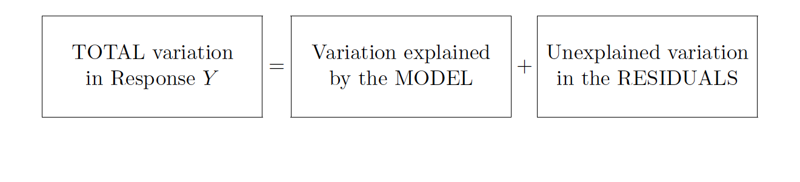

```{r child = "setup.Rmd"}
```

layout: true

<div class="my-footer">
<span>
Dr. Lucy D'Agostino McGowan
</span>
</div> 

---

## Partitioned variablity




---

## Why?

* $y - \bar{y}=(\hat{y}-\bar{y})+(y-\hat{y})$
--

* $\sum(y-\bar{y})^2=\sum(\hat{y}-\bar{y})^2+\sum(y-\hat{y})^2$
--

* **Total Sum of Squares = Model Sum of Squares + Residual Sum of Squares**
--

* **TSS = ModelSS + RSS**

---

## Goodness of Fit


* $R^2$: coefficient of determination, percentage of the variance explained

--

$$R^2=1-\frac{\sum(y_i-\hat{y}_i)^2}{\sum(y_i-\bar{y})^2}= 1 - \frac{RSS}{TSS}$$

--

* Between 0 and 1, higher is better

---

## Goodness of Fit

* $\hat\sigma$ is also used as a goodness of fit measure
--

* **Advantage**: This is measured in the units of the outcome, so it can be interpreted in the context of the data at hand
--

* **Disadvantage**: Makes it harder to compare across contexts, for this same reason


