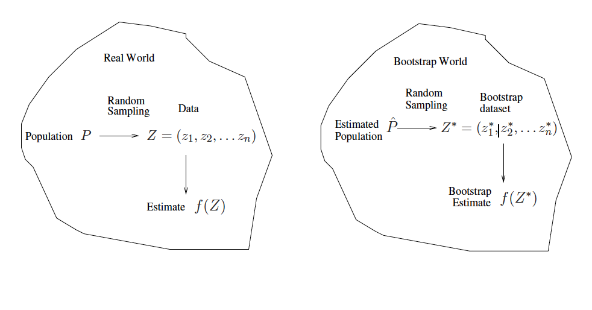

```{r child = "setup.Rmd"}
```

layout: true

<div class="my-footer">
<span>
Dr. Lucy D'Agostino McGowan
</span>
</div> 

---

## Simulation

* Generate $\epsilon$ from the known error distribution
--

* Calculate $\mathbf{y}=\mathbf{X}\beta+\epsilon$ from the known $\beta$ and the observed data, $\mathbf{X}$
--

* Use this to compute $\hat\beta$
--

* Do this _many times_ to get a distribution of $\hat\beta$ and estimate the uncertainty from that

---

## Simulation

* This sounds **great!** 
--

* but...we don't know the true error distribution and we don't know the true $\beta$ (womp womp!)

---

## Bootstrap

* That is where the bootstrap comes in!
--

* The bootstrap tries to estimate the same procedure as the simulation method except instead of sampling from the **true** distribution, we sample from the **observed data**

---

## Bootstrap

.question[
Where does the term come from?
]

--

_"To pull oneself up by one's bootstraps"_

--

The phrase likely came from an 18th century writing "The Surprising Adventures of Baron Munchausen" by Rudolph Erich Raspe

_"The Baron had fallen to the bottom of a deep lake. Just
when it looked like all was lost, he thought to **pick himself
up by his own bootstraps**."_
---

## Bootstrap



.small[
_adapted from slides by Hastie & Tibshirani_
]
---

## Bootstrap

* Used to estimate _uncertainty_.
--

* For example, the standard error of the estimate or an approximate confidence interval

---

## Bootstrap

* Generate $\epsilon^*$ from sampling with replacement from $e_1,\dots,e_n$ (the residuals)
--

* Calculate $\mathbf{y}^* =\mathbf{X}\hat\beta+\epsilon^*$
--

* Compute $\hat\beta^*$ from $(\mathbf{X}, \mathbf{y}^*)$

---

## Generate $\epsilon^*$ from sampling with replacement from the residuals

```{r, echo = FALSE}
d <- mtcars[1:5, ]
m <- lm(mpg ~ cyl, d)
e <- data.frame(e = residuals(m), row.names = NULL)
knitr::kable(e)
```

--

.question[
How would I sample with replacement?
]

---

## Generate $\epsilon^*$ from sampling with replacement from the residuals

.question[
How would I sample with replacement?
]

```{r, echo = FALSE}
set.seed(1)
e <- tibble::tibble(
  `e` = residuals(m),
  `e* 1` = sample(residuals(m), replace = TRUE),
  `e* 2` = sample(residuals(m), replace = TRUE),
  `e* 3` = sample(residuals(m), replace = TRUE),
  `e* 4` = sample(residuals(m), replace = TRUE),
  `e* 5` = sample(residuals(m), replace = TRUE),
  row.names = NULL
)
knitr::kable(e)
```


---

## Let's do this in R!

* The `sample()` function allows you to resample with replacement.

--

```{r}
sample(c(1, 2, 3), replace = TRUE)
```

--

```{r}
sample(c(1, 2, 3), replace = TRUE)
```

--

```{r}
sample(c(1, 2, 3), replace = TRUE)
```

---

## Let's do this in R!

* The `sample()` function allows you to resample with replacement.

```{r}
set.seed(1)
sample(c(1, 2, 3), replace = TRUE)
```

```{r}
set.seed(1)
sample(c(1, 2, 3), replace = TRUE)
```

---

## Let's do this in R!

* The `sample()` function allows you to resample with replacement.

.pull-left[
.small[
```{r}
set.seed(1)
sample(c(1, 2, 3), replace = TRUE)
sample(c(1, 2, 3), replace = TRUE)
sample(c(1, 2, 3), replace = TRUE)
```

]
]

--

.pull-right[
.small[
```{r}
set.seed(1)
sample(c(1, 2, 3), replace = TRUE)
sample(c(1, 2, 3), replace = TRUE)
sample(c(1, 2, 3), replace = TRUE)
```
]
]

--

* **Always set a seed when generating random processes so you can replicate your results**

---

class: inverse

## `r fa("laptop")` `Application Exercise`

* Set a seed
* Use the `sample()` function to sample from the following vector with replacement: `c(1, 2, 3, 4, 5)`

`r countdown(2)`

---
## Let's do this in R


* Generate $\epsilon^*$ from sampling with replacement from $e_1,\dots,e_n$ (the residuals)

```{r, eval = FALSE}
e_star <- sample(e, replace = TRUE) 
```
--

* Calculate $\mathbf{y}^* =\mathbf{X}\hat\beta+\epsilon^*$

```{r, eval = FALSE}
y_star <- y_hat + e_star
```

--

* Compute $\hat\beta^*$ from $(\mathbf{X}, \mathbf{y}^*)$

```{r, eval = FALSE}
new_mod <- update(model, y_star ~ ., data = data)
coef(new_mod)
```

---

## Let's do this in R

Let's build a function to do this **once**


.small[
```{r}
bootstrap_residual <- function(e, y_hat, model, data) { #<<
  e_star <- sample(e, replace = TRUE) 
  data$y_star <- y_hat + e_star
  new_mod <- update(model, y_star ~ ., data = data)
  return(coef(new_mod))
}
```
]

---

## Let's do this in R

Let's build a function to do this **once**

```{r}
bootstrap_residual <- function(e, y_hat, model, data) { 
  e_star <- sample(e, replace = TRUE) #<<
  data$y_star <- y_hat + e_star
  new_mod <- update(model, y_star ~ ., data = data)
  return(coef(new_mod))
}
```

---

## Let's do this in R

Let's build a function to do this **once**

```{r}
bootstrap_residual <- function(e, y_hat, model, data) { 
  e_star <- sample(e, replace = TRUE) 
  data$y_star <- y_hat + e_star #<<
  new_mod <- update(model, y_star ~ ., data = data)
  return(coef(new_mod))
}
```

---

## Let's do this in R

Let's build a function to do this **once**

```{r}
bootstrap_residual <- function(e, y_hat, model, data) { 
  e_star <- sample(e, replace = TRUE) 
  data$y_star <- y_hat + e_star
  new_mod <- update(model, y_star ~ ., data = data) #<<
  return(coef(new_mod))
}
```

--

* The `update()` function will update a model with a new formula. Here we are swapping out `y` from our original `model` with `y_star`

---
## Let's do this in R

Let's build a function to do this **once**

```{r}
bootstrap_residual <- function(e, y_hat, model, data) { 
  e_star <- sample(e, replace = TRUE) 
  data$y_star <- y_hat + e_star
  new_mod <- update(model, y_star ~ ., data = data)
  return(coef(new_mod)) #<<
}
```

---

class: inverse

## `r fa("laptop")` `Application Exercise`

* Write a function like the one on the previous slide to perform a bootstrap.

`r countdown(2)`
---

## Let's do this in R


```{r, echo = FALSE}
library(ISLR)
```

```{r}
model <- lm(mpg ~ horsepower, data = Auto)
y_hat <- fitted(model)
e <- residuals(model)
```

--

.pull-left[
.small[
```{r}
set.seed(1)
e_star <- sample(e, replace = TRUE) 
Auto$y_star <- y_hat + e_star
new_mod <- update(model, y_star ~ ., data = Auto)
coef(new_mod)
```
]
]

--

.pull-right[
.small[
```{r}
set.seed(1)
bootstrap_residual(e, y_hat, model, Auto)
```

]]

---

## Let's do this in R


```{r}
model <- lm(mpg ~ horsepower, data = Auto)
y_hat <- fitted(model)
e <- residuals(model)
```


.pull-left[
.small[
```{r}
set.seed(1)
e_star <- sample(e, replace = TRUE) 
Auto$y_star <- y_hat + e_star
new_mod <- update(model, y_star ~ ., data = Auto)
coef(new_mod)
```
]
]

.pull-right[
.small[
```{r}
set.seed(1)
bootstrap_residual(e, y_hat, model, Auto)
```


```{r}
bootstrap_residual(e, y_hat, model, Auto)
```

]]

---


## Let's do this in R


```{r}
model <- lm(mpg ~ horsepower, data = Auto)
y_hat <- fitted(model)
e <- residuals(model)
```


.pull-left[
.small[
```{r}
set.seed(1)
e_star <- sample(e, replace = TRUE) 
Auto$y_star <- y_hat + e_star
new_mod <- update(model, y_star ~ ., data = Auto)
coef(new_mod)
```
]
]


.pull-right[
.small[
```{r}
set.seed(1)
bootstrap_residual(e, y_hat, model, Auto)
```


```{r}
bootstrap_residual(e, y_hat, model, Auto)
```

```{r}
bootstrap_residual(e, y_hat, model, Auto)
```

]]

---

## purrr 


- **purrr** is a package for _iterating_ in R
- The functions we will use are all `map_xxx()` functions 

---

## `map(.x, .f, ...)`

--

### for every element of `.x` do `.f`

---

## Example

.small[
```{r, echo = TRUE}
library(purrr)
map(1:5, ~ .x * 2)
```
]

--

* By default, the output will be a **list**
--

* You can dictate your desired output type by specifying `map_xxx()` for example to output a numeric (double) vector, use `map_dbl()`

---

## Example

.small[
```{r, echo = TRUE}
map_dbl(1:5, ~ .x * 2)
```
]

---

## `map_xxx(.x, .f)`

* `map()`: list
* `map_dbl()`: double
* `map_int()`
* `map_lgl()`
* `map_chr()`
* `map_df()`

--

.question[
What do you think the rest of these output?
]

---

## `map_xxx(.x, .f)`

* `map()`: list
* `map_dbl()`: double
* `map_int()`: integer
* `map_lgl()`: logical
* `map_chr()`: character
* `map_df()`: data frame

.question[
What do you think the rest of these output?
]

---

## Back to our example!

.pull-left[
.small[
```{r, echo = TRUE}
B <- 1000
map(1:B, ~ bootstrap_residual(e, y_hat, model, Auto))
```
]
]

.pull-right[
.question[
How can I get these into a data frame?
]
]

---

## Back to our example!

.pull-left[
.small[
```{r, echo = TRUE}
B <- 1000
map_df(1:B, ~ bootstrap_residual(e, y_hat, model, Auto))
```
]
]

.pull-right[
.question[
How can I get these into a data frame?
]
]

---

class: inverse

## `r fa("laptop")` `Application Exercise`

* Using the function created in the previous application exercise, run a bootstrap on the following model:

Using the `mtcars` data set fit a model predicting `mpg` from `wt` and `cyl`.

---
## Bootstrap

* Generate $\epsilon^*$ from sampling with replacement from $e_1,\dots,e_n$ (the residuals)
* Calculate $\mathbf{y}^* =\mathbf{X}\hat\beta+\epsilon^*$
* Compute $\hat\beta^*$ from $(\mathbf{X}, \mathbf{y}^*)$

---

## Bootstrap

```{r, echo = FALSE}
library(ggplot2)
```

```{r}
boot_coefs <- map_df(1:B, ~ bootstrap_residual(e, y_hat, model, Auto))

ggplot(boot_coefs, aes(x = horsepower)) + 
  geom_histogram(bins = 25)
```

---

## Bootstrap

```{r}
ggplot(boot_coefs, aes(x = horsepower)) + 
  geom_histogram(bins = 25) + 
  geom_vline(xintercept = c(quantile(boot_coefs$horsepower, 0.025), quantile(boot_coefs$horsepower, 0.975)))
```

---

## Bootstrap Percentile Confidence Intervals


```{r}
quantile(boot_coefs$horsepower, 0.025)
quantile(boot_coefs$horsepower, 0.975)
```

--

* The `quantile()` function calculates sample quantiles, here we are calculating the 2.5% and 97.5% of the `horsepower` bootstrapped coefficients.

---

## Bootstrap Percentile Confidence Intervals

* The bootstrap percentile confidence interval for the coefficient for horsepower is (-0.170, -0.145)

--
* Let's compare this to the confidence interval calculated using the usual method

--

```{r}
confint(lm(mpg ~ horsepower, data = Auto))
```

---

## Bootstrap "standard error"

* We can also calculate the average coefficient and standard error

--

```{r}
(beta_avg <- mean(boot_coefs$horsepower))
(beta_se <- sd(boot_coefs$horsepower))
```

--

* We can use the "standard error method" to calculate a slightly different bootstrap confidence interval

---

## Bootstrap standard error method

$$\hat\beta_i \pm t^* \hat{SE}_{\beta_i}$$

```{r}
t_star <- qt(0.975, nrow(Auto) - 2)
beta_avg - t_star * beta_se
beta_avg + t_star * beta_se
```

--

* Looks very similar!


---


## Bootstrap

.small[
```{r}
ggplot(boot_coefs, aes(x = horsepower)) + 
  geom_histogram(bins = 25) + 
  geom_vline(xintercept = c(quantile(boot_coefs$horsepower, 0.025), quantile(boot_coefs$horsepower, 0.975))) 
```
]
---

## Bootstrap

.small[
```{r}
ggplot(boot_coefs, aes(x = horsepower)) + 
  geom_histogram(bins = 25) + 
  geom_vline(xintercept = c(quantile(boot_coefs$horsepower, 0.025), quantile(boot_coefs$horsepower, 0.975))) + 
  geom_vline(xintercept = c(beta_avg - t_star * beta_se, beta_avg + t_star * beta_se), lty = 2) 
```

]
---

## Bootstrap

.small[
```{r}
ggplot(boot_coefs, aes(x = horsepower)) + 
  geom_histogram(bins = 25) + 
  geom_vline(xintercept = c(quantile(boot_coefs$horsepower, 0.025), quantile(boot_coefs$horsepower, 0.975))) + 
  geom_vline(xintercept = c(beta_avg - t_star * beta_se, beta_avg + t_star * beta_se), lty = 2) + 
  geom_vline(xintercept = confint(lm(mpg ~ horsepower, Auto))[2, ], lty = 3)
```
]

---

class: inverse

## `r fa("laptop")` `Application Exercise`

* Calculate a bootstrap percentile confidence interval for the coefficient associated with `wt`
* Calculate a bootstrap confidence interval using the standard error method for the coefficient associated with `wt`
* Compare these intervals to the interval computed from the `confint` function.

