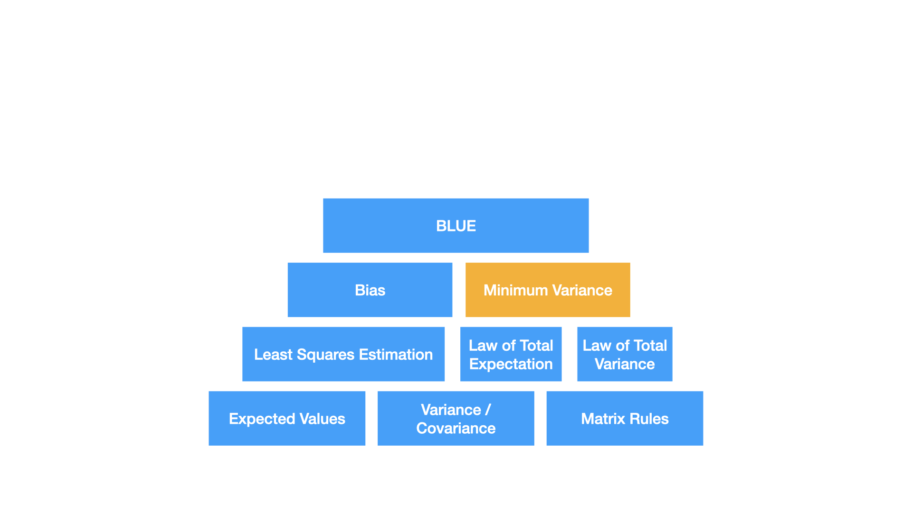
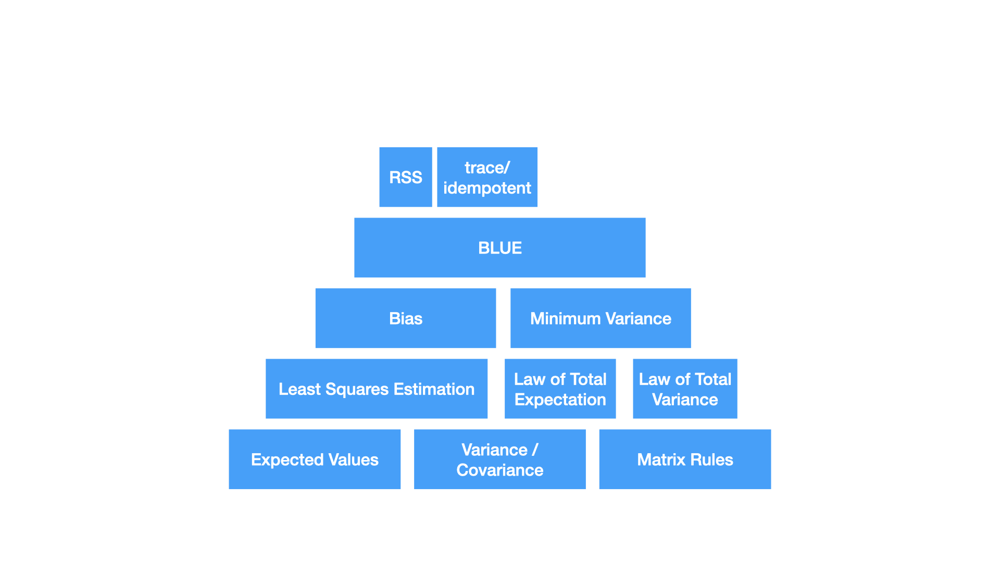
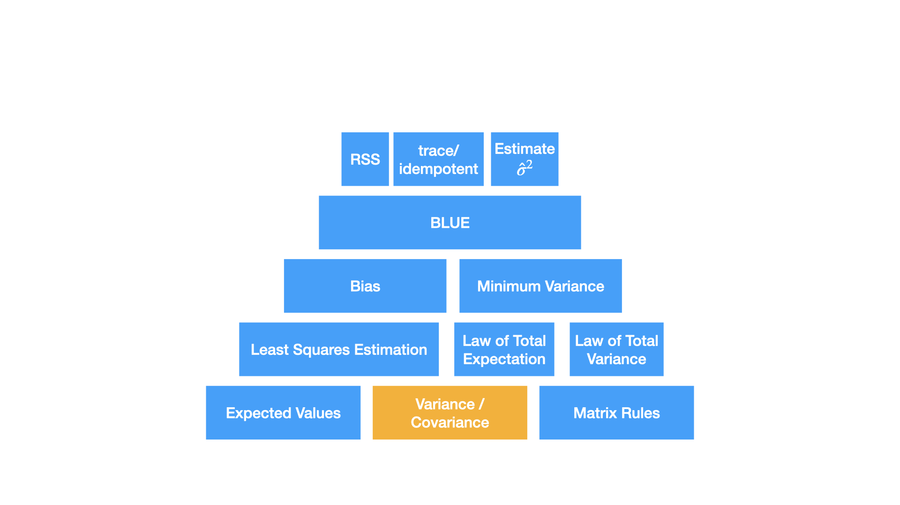

```{r child = "setup.Rmd"}
```

layout: true

<div class="my-footer">
<span>
Dr. Lucy D'Agostino McGowan
</span>
</div> 

---

class: middle 

$$$$


---

class: middle 


$$\Huge\mathbf{y} = \mathbf{X}\beta+\epsilon$$

---

class: middle 


$$\Huge\mathbf{y} = \mathbf{X}\beta+\epsilon$$


---

class: middle 


$$\Huge E[\hat\beta]=\beta$$

---

class: middle 


$$\Huge\textrm{var}(\hat\beta)=\hat\sigma^2(\mathbf{X}^T\mathbf{X})^{-1}$$


---

class: middle 


$$\Huge E[\hat\beta-\beta] = 0$$


---

class: middle 


$$\Huge\textrm{var}(\hat\beta)=\hat\sigma^2(\mathbf{X}^T\mathbf{X})^{-1}$$


---


class: middle 


$$\Large\textrm{var}(\hat\beta)=\hat\sigma^2(\mathbf{X}^T\mathbf{X})^{-1}\leq \textrm{var}(\tilde\beta)$$

---

class: middle 


$$\Huge E[\tilde\beta-\beta]=0$$


---

class: middle 


$$\Large\textrm{var}(\hat\beta)=\hat\sigma^2(\mathbf{X}^T\mathbf{X})^{-1}\leq \textrm{var}(\tilde\beta)$$


---

class: middle 


$$\Huge\textrm{RSS}=\sum e^2$$

---

class: middle 


$$\Huge\textrm{RSS}=\sum e^2$$


---

class: middle 


$$\Huge E[\mathbf{e}^T\mathbf{e}] = \sigma^2(n-(p+1))$$



---

class: middle 


$$\Large E[\mathbf{e}^T\mathbf{e}]=E[\mathbf{y}^T(\mathbf{I-H})\mathbf{y}]$$


---

class: middle 


$$\Huge\hat\sigma^2=\frac{\textrm{RSS}}{(n-(p+1))}$$


---

class: middle 


$$\Huge\hat\sigma^2=\frac{\textrm{RSS}}{(n-(p+1))}$$



---

class: middle 


$$\Huge\textrm{var}(\hat\beta) = \hat\sigma^2(\mathbf{X}^T\mathbf{X})^{-1}$$


---

class: middle 


$$F = \frac{RSS_{small} - RSS_{larger} / (df_{small}- df_{larger})}{RSS_{larger}/df_{larger}}\sim F_{df_{small}- df_{larger}, df_{larger}}$$


---

class: middle 


$$F = \frac{RSS_{small} - RSS_{larger} / (df_{small}- df_{larger})}{RSS_{larger}/df_{larger}}\sim F_{df_{small}- df_{larger}, df_{larger}}$$


---

class: middle 


$$F = \frac{RSS_{small} - RSS_{larger} / (df_{small}- df_{larger})}{RSS_{larger}/df_{larger}}\sim F_{df_{small}- df_{larger}, df_{larger}}$$


---

class: middle 


$$F = \frac{RSS_{small} - RSS_{larger} / (df_{small}- df_{larger})}{RSS_{larger}/df_{larger}}\sim F_{df_{small}- df_{larger}, df_{larger}}$$


---

class: middle 


$$\Huge\hat\beta\pm t^*SE_{\hat\beta}$$


